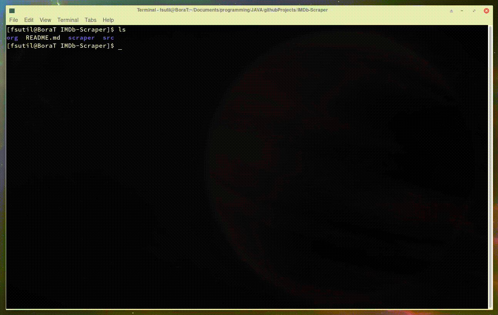

I wrote this module to use in my another project[**[1]**](https://github.com/boratanrikulu/projectsJAVA/tree/master/java.util.help-PT4-Cinema).  
It scrapes **"In Theaters Now"** list from [imdb.com](https://www.imdb.com/)

<p align="center">
	
</p>

You can use the following commands to use the program:

```Bash
	cd /path/to/IMDb-Scraper
	javac src/*.java -d .
	java scraper.ScraperTest
```